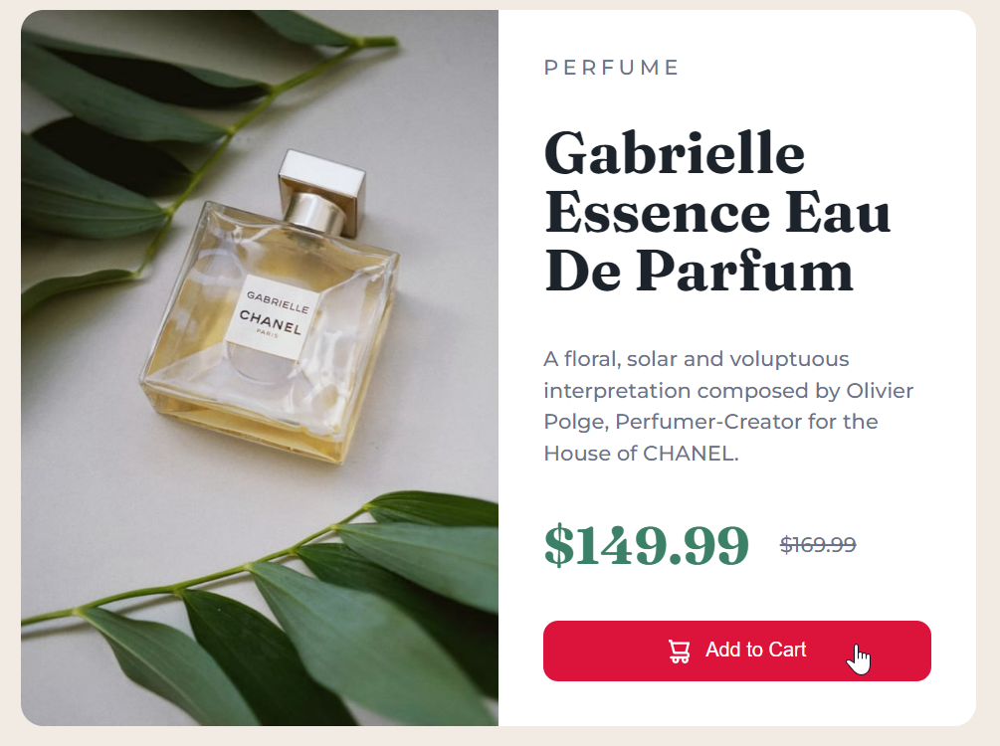

# DOM Assignment 9 Solution

## Task 1

Change text color of heading


- ## Solution

```js
let heading = document.getElementsByTagName('h1')[0];
heading.style.color = 'red';
```


## Task 2

Change background of button


- ## Solution

```js
let btn = document.querySelector('.add-to-cart');
btn.style.backgroundColor = '#c71e5c';
```




